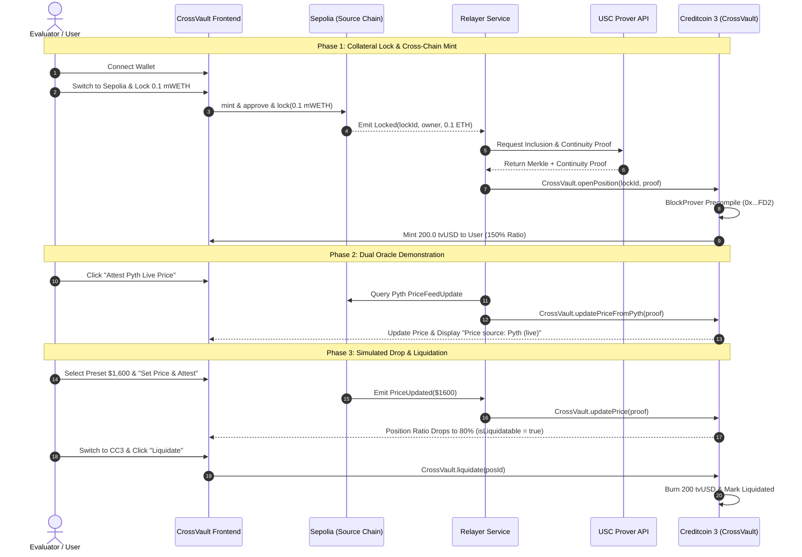

# CrossVault Judge Demo Script & Runbook

This guide provides a comprehensive, click-by-click walkthrough for demonstrating **CrossVault** live to hackathon judges. Follow each step in order to showcase the complete cross-chain lifecycle: connecting wallets, depositing collateral on Sepolia, generating and verifying Attestcoin cryptographic proofs on Creditcoin 3, demonstrating real-time Pyth oracle integration, shifting the manual demo price to trigger an undercollateralized state, and executing on-chain liquidation.

---

## 1. Pre-Demo Setup & Verification

### A. Start Required Services
Ensure the Relayer and Frontend are active in separate terminal tabs:

```bash
# Terminal 1: Start Relayer
cd relayer
npm run start
# Expected output: Relayer service listening on port 3001

# Terminal 2: Start Frontend Web Application
cd frontend
npm run dev
# Expected output: Local: http://localhost:5173/
```

### B. Wallet Preparation
Open your browser with MetaMask (or any EVM-compatible browser wallet):
- **Account**: Ensure your wallet has gas funds:
  - **Ethereum Sepolia**: `>= 0.05 Sepolia ETH`
  - **Creditcoin 3 Testnet**: `>= 1.0 tCTC`
- **Contract Reference**:
  - **Sepolia CollateralLock**: `0x819068a43Ec7f7367B025B7dF0FAbeAdf70F173f`
  - **Sepolia MockPriceFeed**: `0x5Eb309a76C6E993293CD756d938BBb35F3bFd35f`
  - **Sepolia Pyth Contract**: `0xDd24F84d36BF92C65F92307595335bdFab5Bbd21`
  - **Creditcoin 3 CrossVault**: `0x4D7F912075EF21A400125821f1dA303DF7e1444A`
  - **Creditcoin 3 DebtToken (tvUSD)**: `0xD709d29D35D99370f75770fC48dBEa3aE6277eB4`

---

## 2. Step-by-Step Demonstration Flow



---

### Step 1: Connect Wallet & Inspect Initial State

1. Navigate to `http://localhost:5173` in your browser.
2. In the top-right navigation bar, click **`Connect Wallet`**.
3. Approve the connection request in MetaMask.
4. **Verify On-Screen**:
   - **Account Pill**: Displays your shortened wallet address (e.g. `0x48d3...9438`).
   - **Network Badge**: Indicates your active network (**Sepolia** or **Creditcoin Testnet**).
   - **Top Protocol Banner**: Shows collateral token `mWETH (Sepolia)`, debt token `tvUSD (Creditcoin 3)`, precompile `USC BlockProver (0x...FD2)`, and your current `tvUSD Balance`.
   - **Footer Status**: Shows `● Relayer Online (port 3001)`.

---

### Step 2: Switch to Sepolia & Deposit Collateral

1. In the header network switcher, click **`Sepolia`** (or approve the network switch in MetaMask).
2. Locate the **Lock & Borrow** panel on the left side:
   - **Collateral Input**: Type `0.1` (or click `0.1`, `0.5`, `1.0` quick chips).
   - Notice the dynamic calculation box:
     - *Collateral Deposit*: `0.10 mWETH`
     - *Oracle Valuation*: `$300.00 USD` (at $3,000 baseline price)
     - *tvUSD Debt Minted (150% MCR)*: `200.00 tvUSD`
3. Click the primary button: **`Lock & Borrow 0.1 mWETH`**.
4. **MetaMask Transaction Sequence**:
   - *If your mWETH balance is 0*: MetaMask will prompt to mint testnet collateral first (`MockCollateralToken.mint`). Click **Confirm**.
   - *Token Approval*: MetaMask prompts to approve `CollateralLock` to spend mWETH. Click **Confirm**.
   - *Deposit & Lock*: MetaMask prompts to call `CollateralLock.lock(0.1 ether)`. Click **Confirm**.
5. **Watch the Live Step Progress Tracker in the UI**:
   - `✓ Step 1/3: Collateral Locked on Sepolia (Lock ID: #X, Tx: 0x...)`
   - `⏳ Step 2/3: Requesting Merkle Inclusion Proof from USC Prover API...`
   - `⏳ Step 3/3: Submitting Proof to Creditcoin 3 Precompile (0x...FD2)...`
   - `✓ Position Opened Successfully!`

---

### Step 3: Switch to Creditcoin 3 & Verify Position Dashboard

1. In the top header, click **`Creditcoin Testnet`**.
   - *If prompted by MetaMask to add the network, click **Approve** (network details: Chain ID `102031`, RPC `https://rpc.cc3-testnet.creditcoin.network`, Symbol `tCTC`).*
2. View the **Position Dashboard** on the right side:
   - **Vault Collateral Price Tag**: Shows `$3000.00 tvUSD`.
   - **Table Row**:
     - **ID**: `#1` (or your new position ID).
     - **Owner**: Your wallet address (highlighted with a `"You"` badge).
     - **Collateral**: `0.1000 mWETH`.
     - **Debt**: `200.00 tvUSD`.
     - **Collateral Ratio**: `150.0%` with a green **`Healthy`** badge.
     - **Liquidation Action**: Blank / No button (ineligible for liquidation).
3. Check the top banner:
   - **Your tvUSD Balance**: Shows `200.00 tvUSD` minted directly to your account.

---

### Step 4: Demonstrate Dual Oracle — Attest Live Pyth Price

1. In the **Oracle Price Feeds** card:
   - Notice the **Pyth Network (Live Oracle)** section with purple accents.
   - Click the purple button: **`Attest Pyth Live Price`**.
2. **Expected Behavior**:
   - The UI displays: *"Querying latest Pyth ETH/USD update on Sepolia & requesting attest proof..."*
   - Relayer calls `POST /attest/price/pyth`, fetches the verified inclusion proof for Pyth's on-chain `PriceFeedUpdate`, and submits `CrossVault.updatePriceFromPyth(proof)` to Creditcoin 3.
   - Status updates: `Pyth live price successfully attested on Creditcoin 3! Tx: 0x...`
3. **Verify Dashboard Changes**:
   - **Price Tag Badge**: Changes to **`Price source: Pyth (live)`** with purple styling.
   - **Vault Collateral Price**: Reflects the real-time Pyth price (e.g. `$2,396.97 tvUSD`).
   - **Position Ratio**: Automatically recalculates to `~119.8%` based on live market pricing.

---

### Step 5: Demonstrate Labeled Demo-Control — Trigger Liquidation Warning

> **Judge Talking Point**: *"In production evaluation, waiting for real Ethereum market volatility to crash is impractical. We preserved `MockPriceFeed` as an explicitly labeled demo-control feature so evaluators can deterministically drop the price and inspect liquidation mechanics on demand."*

1. In the **Manual MockPriceFeed (Demo-Control Feature)** section:
   - Click the red quick-preset chip: **`$1,600 (Trigger Liquidation)`**.
   - The input automatically populates with `1600`.
2. Click **`Set Price & Attest`**.
   - If currently on Creditcoin, MetaMask will prompt to switch to **Sepolia** to sign the owner transaction. Click **Confirm**.
   - MetaMask prompts to confirm `MockPriceFeed.setPrice(1600 ether)`. Click **Confirm**.
3. **Watch the Automated Attestation**:
   - Once confirmed on Sepolia, the relayer submits the `PriceUpdated` proof to `CrossVault.updatePrice` on Creditcoin 3.
   - Status updates: `Price updated on Creditcoin! Tx: 0x...`
4. **Verify Position Dashboard Changes**:
   - **Vault Price Tag**: Shows `$1600.00 tvUSD`.
   - **Price Source Badge**: Displays **`Price source: Manual (demo)`** in amber.
   - **Collateral Value**: `0.1 mWETH * $1,600 = $160.00 USD`.
   - **Debt Outstanding**: `200.00 tvUSD` (liquidation threshold at 120% = `$240.00 USD`).
   - **Collateral Ratio**: Drops to **`80.0%`**.
   - **Health Badge**: Flips to a red warning: **`⚠️ LIQUIDATABLE (< 120%)`**.
   - **Action Column**: A red button **`Liquidate`** appears on the row!

---

### Step 6: Execute On-Chain Liquidation

1. If on Sepolia, click **`Creditcoin Testnet`** in the header to switch back to CC3.
2. On the undercollateralized position row, click the red **`Liquidate`** button.
3. **MetaMask Prompts**:
   - *Token Approval (if not previously approved)*: Prompts to approve `tvUSD` to `CrossVault`. Click **Confirm**.
   - *Liquidation Transaction*: Prompts to execute `CrossVault.liquidate(positionId)`. Click **Confirm**.
4. **Expected On-Chain Results**:
   - Status displays: *"Position #1 liquidated successfully!"*
   - **Table Row Updates**:
     - Status changes to gray: **`Liquidated`**.
     - `Liquidate` button disappears.
     - Position is marked as closed.
   - **Banner Balance**: Your `tvUSD` balance decreases by `200.00 tvUSD` (burned from circulation to maintain protocol solvency).

---

## 3. Judge Q&A & Technical Highlights

| Question | Answer & Technical Architecture |
| :--- | :--- |
| **How does Creditcoin know the lock happened on Sepolia?** | Creditcoin 3 contains an integrated EVM precompile (`0x...FD2`) called `BlockProver`. When collateral is locked on Sepolia, the off-chain relayer requests cryptographic Merkle inclusion proofs and header continuity proofs from the USC Prover. `CrossVault` invokes the precompile directly in Solidity to verify proof validity and decodes the event topics/data on-chain. |
| **Can proofs be replayed or forged?** | No. `CrossVault` tracks used lock IDs via `usedLockIds(lockId)` and price update proof IDs via `usedPriceProofs(proofId)`. Any replayed proof reverts with custom error `LockAlreadyUsed()` or `ProofAlreadyUsed()`. |
| **Why are there two oracle options?** | **Pyth Network** serves as the live decentralized oracle verifying signed price feeds from Sepolia (`0xDd24...bd21`). **MockPriceFeed** is retained strictly as an authorized, labeled demo-control feature so judges can trigger specific numeric scenarios (e.g. dropping below the 120% liquidation threshold) without waiting for real-world price swings. |
| **Where does the liquidated collateral go?** | Because Attestcoin attestation currently flows from source chains into Creditcoin, the liquidation demonstrates the CC3 risk engine (burning unbacked debt tokens). Real-world custody reversal can be integrated with cross-chain message relays or native multi-party vaults. |

---

## 4. Explorer & Contract Verification Links

- **Sepolia Etherscan**:
  - [CollateralLock: `0x819068a43Ec7f7367B025B7dF0FAbeAdf70F173f`](https://sepolia.etherscan.io/address/0x819068a43Ec7f7367B025B7dF0FAbeAdf70F173f)
  - [MockPriceFeed: `0x5Eb309a76C6E993293CD756d938BBb35F3bFd35f`](https://sepolia.etherscan.io/address/0x5Eb309a76C6E993293CD756d938BBb35F3bFd35f)
  - [Pyth Sepolia: `0xDd24F84d36BF92C65F92307595335bdFab5Bbd21`](https://sepolia.etherscan.io/address/0xDd24F84d36BF92C65F92307595335bdFab5Bbd21)
- **Creditcoin 3 Testnet Blockscout**:
  - [CrossVault: `0x4D7F912075EF21A400125821f1dA303DF7e1444A`](https://creditcoin-testnet.blockscout.com/address/0x4D7F912075EF21A400125821f1dA303DF7e1444A)
  - [DebtToken (tvUSD): `0xD709d29D35D99370f75770fC48dBEa3aE6277eB4`](https://creditcoin-testnet.blockscout.com/address/0xD709d29D35D99370f75770fC48dBEa3aE6277eB4)
