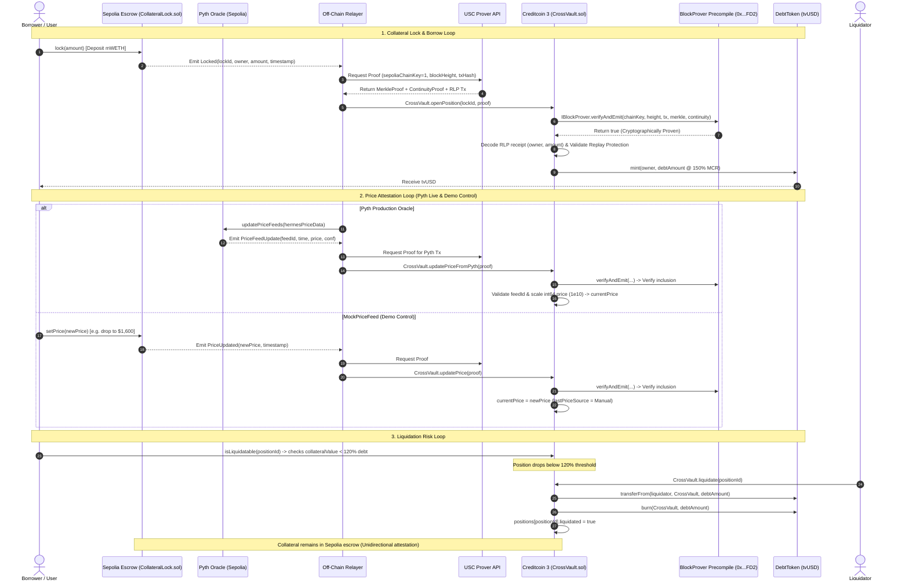

# CrossVault: Trust-Minimized Cross-Chain Lending via Attestcoin

> **Built for BUIDL CTC 2026 Fall — DeFi track**

[](https://sepolia.etherscan.io)
[-darkgreen?style=flat-square)](https://creditcoin-testnet.blockscout.com)
[](https://docs.creditcoin.org)
[](https://pyth.network)
[](LICENSE)

CrossVault is an end-to-end, trust-minimized cross-chain lending protocol that enables users to lock native collateral (mWETH) on **Ethereum Sepolia** and borrow decentralized stablecoin debt (`tvUSD`) on **Creditcoin 3 (CC3) Testnet**. By utilizing Creditcoin's native **Attestcoin / Universal Smart Contract (USC)** cryptographic precompile (`0x0000000000000000000000000000000000000FD2`), CrossVault verifies foreign block headers and transaction inclusion proofs directly within Creditcoin EVM consensus — eliminating the custodial risk, depeg vulnerability, and multi-billion-dollar attack surface of traditional cross-chain bridges and synthetic wrapped tokens.

---

### Tech Stack

- **Smart Contracts**: Solidity (`^0.8.20`), Foundry / Forge (testing, deployment scripts, gas optimization)
- **Settlement Blockchain**: Creditcoin CC3 Testnet (EVM-compatible Substrate chain, Chain ID: `102031` / `0x18E8F`)
- **Cross-Chain Attestation**: Attestcoin Protocol (`BlockProver` precompile `0x0000000000000000000000000000000000000FD2`), `@gluwa/usc-sdk`
- **Oracle Infrastructure**: Pyth Network (`@pythnetwork/hermes-client` + Pyth Sepolia contract)
- **Frontend & Web3 Client**: React 18, Vite, Tailwind CSS, ethers.js v6

---

## Table of Contents
1. [What CrossVault Does & Why](#1-what-crossvault-does--why)
2. [End-to-End Architecture](#2-end-to-end-architecture)
   - [Protocol Flowchart](#protocol-flowchart)
   - [Core Architecture Loops](#core-architecture-loops)
3. [Attestcoin Protocol Integration (Judging Focus)](#3-attestcoin-protocol-integration-judging-focus)
   - [The BlockProver Precompile (0x...FD2)](#the-blockprover-precompile-0x0000000000000000000000000000000000000fd2)
   - [Precompile Call Site 1: Collateral Verification & Debt Minting](#call-site-1-openpositionuint256-lockid-txproof-calldata-proof)
   - [Precompile Call Site 2: Manual / Demo Price Attestation](#call-site-2-updatepricetxproof-calldata-proof)
   - [Precompile Call Site 3: Pyth Production Price Attestation](#call-site-3-updatepricefrompythtxproof-calldata-proof)
   - [Attestcoin Integration Summary Table](#attestcoin-integration-summary-table)
4. [Protocol Limitations & Architectural Honesty](#4-protocol-limitations--architectural-honesty)
   - [One-Directional Attestation Guarantee](#one-directional-attestation-guarantee)
   - [What Liquidation Does (and Does NOT) Do to Collateral](#what-liquidation-does-and-does-not-do)
   - [Path to Full Production Bidirectional Custody](#path-to-full-production-bidirectional-custody)
5. [Deployed Contract Addresses](#5-deployed-contract-addresses)
6. [Setup & Run Instructions](#6-setup--run-instructions)
   - [Prerequisites](#prerequisites)
   - [Environment Configuration](#environment-configuration)
   - [Running the Relayer](#running-the-relayer)
   - [Running the Frontend Application](#running-the-frontend-application)
   - [Automated End-to-End Live Test](#automated-end-to-end-live-test)
   - [Running Unit & Contract Test Suites](#running-unit--contract-test-suites)
7. [Live Demo Walkthrough](#7-live-demo-walkthrough)

---

## 1. What CrossVault Does & Why

### The Problem with Traditional Cross-Chain Lending
Cross-chain decentralized finance has historically relied on **lock-and-mint bridges**, **centralized multi-signature custodians**, or **synthetic wrapped tokens** (e.g., wETH, wrapped BTC). These architectures introduce massive systemic vulnerabilities:
- **Catastrophic Bridge Hacks**: Over $3B+ in user funds have been stolen due to compromised bridge signer keys, off-chain validator exploits, or smart contract logic flaws in wrapped token custodians.
- **Liquidity Fragmentation**: Users must swap native assets into synthetic wrapped representations, splintering liquidity across chains and introducing depeg risks.
- **Counterparty & Custodial Trust**: Borrowers must trust third-party relayers or multi-sig committees not to freeze or rehypothecate their underlying collateral.

### The CrossVault Solution
CrossVault eliminates cross-chain bridges and synthetic wrapped tokens by leveraging **Attestcoin / Universal Smart Contracts (USC)**:
1. **Collateral Stays Native on Ethereum**: Borrowers deposit native mWETH into an immutable escrow smart contract (`CollateralLock.sol`) on Ethereum Sepolia.
2. **Cryptographic Proofs Over Multi-Sig Trust**: An off-chain relayer captures the Ethereum receipt and queries the USC Prover for a Merkle inclusion proof and block continuity proof.
3. **Consensus-Enforced Validation on Creditcoin 3**: Creditcoin's on-chain lending contract (`CrossVault.sol`) invokes the precompiled `BlockProver` (`0x...FD2`). The Creditcoin consensus layer verifies that the transaction actually occurred on Ethereum.
4. **Direct Stablecoin Debt Minting**: Upon successful precompile verification, Creditcoin 3 mints native `tvUSD` debt tokens directly to the borrower's address at a 150% Minimum Collateralization Ratio (MCR).

---

## 2. End-to-End Architecture

### Protocol Flowchart



### Core Architecture Loops

1. **Collateral Escrow & Borrowing Loop**:
   - The user deposits `mWETH` into [`CollateralLock.sol`](file:///C:/Users/USER/crossvault/contracts-sepolia/src/CollateralLock.sol) on Sepolia.
   - The contract assigns an incremental `lockId` and emits `Locked(lockId, owner, amount, timestamp)`.
   - The relayer retrieves the transaction log and requests cryptographic inclusion and continuity proofs from the USC Prover API.
   - The relayer submits the proof to [`CrossVault.openPosition`](file:///C:/Users/USER/crossvault/contracts-creditcoin/src/CrossVault.sol#L113-L151) on CC3.
   - `CrossVault` calls `BlockProver.verifyAndEmit`. If valid, it decodes the RLP transaction receipt on-chain to extract the verified owner and amount, prevents double-spending via `usedLockIds[lockId] = true`, and mints `tvUSD` to the borrower at a 150% collateralization ratio.

2. **Dual Oracle Price Attestation Loop**:
   - **Production Oracle (Pyth Network)**: The relayer queries Pyth Hermes for the latest cryptographic ETH/USD price update, updates the official Sepolia Pyth contract (`0xDd24...bd21`), captures the resulting `PriceFeedUpdate` event, requests a USC proof, and submits it to `CrossVault.updatePriceFromPyth`. `CrossVault` verifies the proof via `BlockProver`, confirms the feed ID (`0xff6149...`), normalizes the price from Pyth's 8 decimals (`expo = -8`) to standard 18 decimals, and updates `currentPrice`.
   - **Demo-Control Oracle (MockPriceFeed)**: Enables deterministic live demonstrations for evaluators. An authorized operator calls `MockPriceFeed.setPrice` on Sepolia (e.g., dropping price from $3,000 to $1,600). The relayer attests the event to `CrossVault.updatePrice` via `BlockProver`, triggering an immediate, deterministic collateral value shift.

3. **Liquidation & Risk Engine Loop**:
   - Position health is assessed continuously:
     $$\text{collateralValue} = \frac{\text{collateralAmount} \times \text{currentPrice}}{10^{18}}$$
     $$\text{liquidationThreshold} = \frac{\text{debtAmount} \times 120}{100}$$
   - When $\text{collateralValue} < \text{liquidationThreshold}$, `isLiquidatable(positionId)` evaluates to `true`.
   - Any liquidator can invoke `CrossVault.liquidate(positionId)`. The contract pulls and burns `debtAmount` of `tvUSD` from the liquidator, permanently closing the position on Creditcoin 3.

---

## 3. Attestcoin Protocol Integration (Judging Focus)

Attestcoin utilization is the foundational core of CrossVault. Rather than using an off-chain oracle or trusted multi-sig bridge, **every cross-chain action is cryptographically proven directly to the Creditcoin 3 EVM state engine**.

### The BlockProver Precompile (`0x0000000000000000000000000000000000000FD2`)

The BlockProver precompile exposes the following interface to smart contracts on Creditcoin 3:

```solidity
interface IBlockProver {
    function verifyAndEmit(
        uint8 chainKey,
        uint64 height,
        bytes calldata encodedTx,
        MerkleProof calldata merkleProof,
        ContinuityProof calldata continuityProof
    ) external returns (bool verified);
}
```

- `chainKey`: Identifies the source blockchain (`1` for Ethereum Sepolia).
- `height`: The Ethereum block number where the transaction was mined.
- `encodedTx`: The full RLP-encoded transaction / receipt data.
- `merkleProof`: Cryptographic proof verifying inclusion of `encodedTx` in the block's Merkle Patricia receipt root.
- `continuityProof`: Cryptographic proof showing the block header connects back to an already-verified state root accepted by Creditcoin 3 validators.

---

### Call Site 1: `openPosition(uint256 lockId, TxProof calldata proof)`
- **File**: [`contracts-creditcoin/src/CrossVault.sol:L118-L125`](file:///C:/Users/USER/crossvault/contracts-creditcoin/src/CrossVault.sol#L118-L125)
- **Why It Is Called**: To verify that a borrower genuinely deposited collateral into `CollateralLock.sol` on Ethereum Sepolia before issuing debt on Creditcoin 3.
- **Invocation**:
  ```solidity
  bool verified = IBlockProver(BLOCK_PROVER).verifyAndEmit(
      sepoliaChainKey,
      proof.height,
      proof.encodedTx,
      proof.merkleProof,
      proof.continuityProof
  );
  if (!verified) revert VerificationFailed();
  ```
- **Security & State Enforcement**:
  1. **Precompile Verification**: Guarantees the transaction was executed in a valid Ethereum Sepolia block without relying on a trusted relayer.
  2. **Replay Protection**: Enforces `usedLockIds[lockId] = true` to ensure no lock receipt can ever be submitted more than once.
  3. **RLP Decoding & Event Matching**: `_decodeAndValidateLockedEvent` parses the RLP receipt logs, asserts that the emitter address matches `sepoliaLockContract`, validates the `Locked(...)` topic, asserts that the decoded `lockId` matches the function argument, and safely extracts the depositor `owner` and `amount`.
  4. **Debt Issuance**: Mints `tvUSD` to the decoded owner at a 150% MCR.

---

### Call Site 2: `updatePrice(TxProof calldata proof)`
- **File**: [`contracts-creditcoin/src/CrossVault.sol:L164-L171`](file:///C:/Users/USER/crossvault/contracts-creditcoin/src/CrossVault.sol#L164-L171)
- **Why It Is Called**: To verify a manual/demo price update emitted by `MockPriceFeed.sol` on Ethereum Sepolia.
- **Invocation**:
  ```solidity
  bool verified = IBlockProver(BLOCK_PROVER).verifyAndEmit(
      sepoliaChainKey,
      proof.height,
      proof.encodedTx,
      proof.merkleProof,
      proof.continuityProof
  );
  if (!verified) revert VerificationFailed();
  ```
- **Security & State Enforcement**:
  1. **Proof Hash Deduplication**: Computes `proofId = keccak256(abi.encode(proof.height, proof.merkleProof.root, keccak256(proof.encodedTx)))` and asserts `!usedPriceProofs[proofId]`.
  2. **Emitter Assertion**: Validates that the event emitter in the RLP payload matches the registered `sepoliaPriceFeed` contract.
  3. **Price Storage**: Sets `currentPrice` and updates `lastPriceSource = PriceSource.Manual`.

---

### Call Site 3: `updatePriceFromPyth(TxProof calldata proof)`
- **File**: [`contracts-creditcoin/src/CrossVault.sol:L197-L204`](file:///C:/Users/USER/crossvault/contracts-creditcoin/src/CrossVault.sol#L197-L204)
- **Why It Is Called**: To verify production real-time price feed updates emitted by the official Pyth Network contract on Ethereum Sepolia (`0xDd24F84d36BF92C65F92307595335bdFab5Bbd21`).
- **Invocation**:
  ```solidity
  bool verified = IBlockProver(BLOCK_PROVER).verifyAndEmit(
      sepoliaChainKey,
      proof.height,
      proof.encodedTx,
      proof.merkleProof,
      proof.continuityProof
  );
  if (!verified) revert VerificationFailed();
  ```
- **Security & State Enforcement**:
  1. **Official Pyth Emitter Check**: Asserts the RLP log emitter is `0xDd24F84d36BF92C65F92307595335bdFab5Bbd21`.
  2. **Feed ID Verification**: Asserts topic 1 matches the ETH/USD feed ID (`0xff61491a931112ddf1bd8147cd1b641375f79f5825126d665480874634fd0ace`).
  3. **Decimal Normalization**: Pyth publishes ETH/USD with 8 decimals (`expo = -8`). `CrossVault` scales the verified int64 price by $10^{18 - 8} = 10^{10}$ (`PYTH_PRICE_SCALE`), producing standard 18-decimal fixed-point precision.
  4. **Price Storage**: Sets `currentPrice` and updates `lastPriceSource = PriceSource.Pyth`.

---

### Attestcoin Integration Summary Table

| Smart Contract Function | Sepolia Emitter Contract | Verified Event Signature | Proof Components Verified by Precompile | On-Chain State Effect on CC3 |
| :--- | :--- | :--- | :--- | :--- |
| **`openPosition`** | `CollateralLock.sol` (`0x8190...173f`) | `Locked(uint256,address,uint256,uint256)` | Merkle Receipt Proof + Header Continuity | Verifies deposit, records position, mints `tvUSD` at 150% MCR |
| **`updatePrice`** | `MockPriceFeed.sol` (`0x5Eb3...d35f`) | `PriceUpdated(uint256,uint256)` | Merkle Receipt Proof + Header Continuity | Replay-checks proof, sets `currentPrice`, tags source `"Manual"` |
| **`updatePriceFromPyth`** | Pyth Sepolia (`0xDd24...bd21`) | `PriceFeedUpdate(bytes32,uint64,int64,uint64)` | Merkle Receipt Proof + Header Continuity | Validates Pyth feed ID, normalizes 8 to 18 decimals, sets `"Pyth"` |

---

## 4. Protocol Limitations & Architectural Honesty

In the spirit of technical rigor and full transparency for hackathon evaluation, CrossVault explicitly documents the operational scope of its cross-chain integration.

### One-Directional Attestation Guarantee
Attestcoin / Universal Smart Contracts (USC) provide **one-directional cryptographic attestation** from foreign source chains (e.g., Ethereum Sepolia) into Creditcoin 3. Creditcoin 3 validators run light clients and Merkle verification engines capable of proving events that occurred on Ethereum.

However, Attestcoin **does not provide reverse outbound message relay or execution back to Ethereum Sepolia**. Creditcoin cannot natively invoke functions on Ethereum contracts.

### What Liquidation Does (and Does NOT) Do

As explicitly documented in the protocol code ([`contracts-creditcoin/src/CrossVault.sol:L259-L262`](file:///C:/Users/USER/crossvault/contracts-creditcoin/src/CrossVault.sol#L259-L262)):

```solidity
// NOTE: This liquidation does not seize the underlying Sepolia collateral,
// because Attestcoin attestation only flows from source chain into Creditcoin, not back.
// This contract demonstrates the risk engine, not cross-chain custody reversal.
```

- **What `liquidate(positionId)` DOES**:
  1. Validates that the position has fallen below the 120% liquidation threshold (`isLiquidatable == true`).
  2. Pulls and **permanently burns** `pos.debtAmount` of `tvUSD` from the liquidator.
  3. Sets `pos.liquidated = true`, preventing the original borrower from ever unlocking or settling the debt position.
  4. **Protects Protocol Solvency on Creditcoin 3**: Eliminates unbacked debt tokens from circulating supply, ensuring total `tvUSD` remains fully backed.

- **What `liquidate(positionId)` DOES NOT DO**:
  - It does **NOT** unlock, seize, or transfer the underlying `mWETH` locked in `CollateralLock.sol` on Sepolia.
  - It does **NOT** transfer Sepolia collateral to the liquidator.

### Path to Full Production Bidirectional Custody
In a production deployment, cross-chain custody reversal can be implemented via:
1. **Decentralized Multi-Sig Escrow / Threshold Signatures**: A validator threshold signature network that listens for `Liquidated(positionId, liquidator)` events on Creditcoin 3 and unlocks the Sepolia collateral to the liquidator.
2. **Reverse ZK Light Client**: Deploying a Creditcoin 3 light client verification contract on Ethereum Sepolia, enabling liquidators to present Merkle proofs of CC3 liquidation to unlock Sepolia escrow.

---

## 5. Deployed Contract Addresses

All contracts are deployed and verified live on **Ethereum Sepolia** and **Creditcoin 3 Testnet**:

### Ethereum Sepolia (Chain ID: `11155111`)

| Contract Name | Address | Explorer Link | Purpose |
| :--- | :--- | :--- | :--- |
| **`MockCollateralToken` (mWETH)** | `0x208Af80035A2009Ec0373264623E417C2c26c6eB` | [Sepolia Etherscan](https://sepolia.etherscan.io/address/0x208Af80035A2009Ec0373264623E417C2c26c6eB) | ERC-20 collateral token with public faucet minting |
| **`CollateralLock`** | `0x819068a43Ec7f7367B025B7dF0FAbeAdf70F173f` | [Sepolia Etherscan](https://sepolia.etherscan.io/address/0x819068a43Ec7f7367B025B7dF0FAbeAdf70F173f) | Escrow contract holding borrower collateral |
| **`MockPriceFeed`** | `0x5Eb309a76C6E993293CD756d938BBb35F3bFd35f` | [Sepolia Etherscan](https://sepolia.etherscan.io/address/0x5Eb309a76C6E993293CD756d938BBb35F3bFd35f) | Demo-control oracle for deterministic testing |
| **Pyth Sepolia Contract** | `0xDd24F84d36BF92C65F92307595335bdFab5Bbd21` | [Sepolia Etherscan](https://sepolia.etherscan.io/address/0xDd24F84d36BF92C65F92307595335bdFab5Bbd21) | Official Pyth Network oracle receiver |
| **Pyth ETH/USD Feed ID** | `0xff61491a931112ddf1bd8147cd1b641375f79f5825126d665480874634fd0ace` | [Pyth Benchmarks](https://pyth.network/price-feeds/crypto-eth-usd) | 8-decimal ETH/USD price identifier |

### Creditcoin 3 Testnet (Chain ID: `102031` / `0x18E8F`)

| Contract Name | Address | Explorer Link | Purpose |
| :--- | :--- | :--- | :--- |
| **`DebtToken` (tvUSD)** | `0xD709d29D35D99370f75770fC48dBEa3aE6277eB4` | [Creditcoin Blockscout](https://creditcoin-testnet.blockscout.com/address/0xD709d29D35D99370f75770fC48dBEa3aE6277eB4) | ERC-20 stablecoin debt token |
| **`CrossVault`** | `0x4D7F912075EF21A400125821f1dA303DF7e1444A` | [Creditcoin Blockscout](https://creditcoin-testnet.blockscout.com/address/0x4D7F912075EF21A400125821f1dA303DF7e1444A) | Core lending vault, proof verifier, risk engine |
| **BlockProver Precompile** | `0x0000000000000000000000000000000000000FD2` | *Native Precompile* | Cryptographic Merkle & continuity validator |
| **USC Prover API** | `https://prover.cc3-testnet.creditcoin.network` | *Prover Endpoint* | Merkle inclusion proof generator |

---

## 6. Setup & Run Instructions

### Prerequisites
- **Node.js**: v18.0.0 or higher (`node -v`)
- **Foundry / Forge**: Latest release (`forge --version`)
- **MetaMask / EVM Browser Wallet**: Configured with:
  - Ethereum Sepolia ETH (faucet: [sepoliafaucet.com](https://sepoliafaucet.com))
  - Creditcoin 3 Testnet tCTC (faucet: [faucet.cc3-testnet.creditcoin.network](https://faucet.cc3-testnet.creditcoin.network))

---

### Environment Configuration

The repository contains a top-level `.env.example` and subproject environment files. Copy `.env.example` to `.env`:

```bash
cp .env.example .env
```

Ensure the following variables are configured:

```env
# Ethereum Sepolia Configuration
SEPOLIA_RPC_URL="https://ethereum-sepolia-rpc.publicnode.com"
SEPOLIA_PRIVATE_KEY="<YOUR_TESTNET_PRIVATE_KEY>"

# Creditcoin 3 Testnet Configuration
CC3_RPC_URL="https://rpc.cc3-testnet.creditcoin.network"
CC3_PRIVATE_KEY="<YOUR_TESTNET_PRIVATE_KEY>"

# Off-Chain Service Endpoints
PROVER_API_URL="https://prover.cc3-testnet.creditcoin.network"
PYTH_HERMES_URL="https://pyth.dourolabs.app/hermes"
PYTH_API_KEY="<YOUR_PYTH_API_KEY>"
RELAYER_PORT=3001
```

Install root dependencies:

```bash
npm install
```

---

### Running the Relayer

The relayer monitors on-chain events, queries the USC Prover, updates Pyth price feeds, and submits cryptographic proofs to Creditcoin 3:

```bash
# Build TypeScript sources
npm run build --workspace=relayer

# Start the relayer service (Port 3001)
npm run start --workspace=relayer
```

*Expected output*:
```text
[Relayer] Initialized contracts:
  Sepolia CollateralLock: 0x819068a43Ec7f7367B025B7dF0FAbeAdf70F173f
  Sepolia MockPriceFeed:  0x5Eb309a76C6E993293CD756d938BBb35F3bFd35f
  Creditcoin CrossVault:  0x4D7F912075EF21A400125821f1dA303DF7e1444A
  BlockProver Precompile: 0x0000000000000000000000000000000000000FD2
Relayer service listening on port 3001
```

---

### Running the Frontend Application

The frontend provides an intuitive web interface for locking collateral, viewing active positions, triggering Pyth or manual price updates, and liquidating undercollateralized positions:

```bash
# Start Vite development server
npm run dev --workspace=frontend

# Or test the optimized production build
npm run build --workspace=frontend
npm run preview --workspace=frontend
```

*Access the application at*: `http://localhost:5173`

---

### Automated End-to-End Live Test

To run the complete cross-chain protocol lifecycle autonomously against live Sepolia and Creditcoin 3 testnet contracts:

```bash
# Run directly with tsx from repo root
npx tsx relayer/scripts/run-live-flow.ts

# Or via npm script:
npm run test:live
```

This script executes:
1. Collateral lock on Sepolia ($0.1\text{ mWETH}$).
2. Proof generation via the USC Prover API.
3. Position opening and `tvUSD` minting on Creditcoin 3 via `BlockProver`.
4. Live Pyth price attestation to Creditcoin 3.
5. Simulated price crash to $1,600 via `MockPriceFeed`.
6. Health ratio evaluation confirming `isLiquidatable == true`.
7. Debt token approval and on-chain liquidation on Creditcoin 3.

---

### Running Unit & Contract Test Suites

CrossVault maintains rigorous, comprehensive automated test suites across every component:

#### 1. Creditcoin 3 Contracts (Foundry)
```bash
cd contracts-creditcoin
forge test -v
```
*Result*: **14 tests passed, 0 failed** (covers `DebtToken`, `CrossVault` MCR logic, RLP receipt decoding, replay protection, Pyth scaling, and liquidation).

#### 2. Ethereum Sepolia Contracts (Foundry)
```bash
cd contracts-sepolia
forge test -v
```
*Result*: **16 tests passed, 0 failed** (covers `MockCollateralToken`, `CollateralLock` sequential ID assignment, and `MockPriceFeed`).

#### 3. Relayer Service (Node.js Test Runner)
```bash
npm test --prefix relayer
```
*Result*: **24 tests passed, 0 failed** (covers health checks, custom error decoding, 404/502/409 HTTP status codes, Pyth Hermes integration, and proof forwarding).

#### 4. Frontend Application (TypeScript & Vite)
```bash
npm run build --prefix frontend
```
*Result*: **Clean build, 0 errors, 0 warnings**.

---

## 7. Live Demo Walkthrough

For hackathon judges and evaluators wishing to test the protocol live in the browser, refer to the complete step-by-step click guide:

👉 **[DEMO_SCRIPT.md](file:///C:/Users/USER/crossvault/DEMO_SCRIPT.md)**

The demo script details:
- **Phase 1**: Locking collateral on Sepolia and receiving `tvUSD` on Creditcoin 3.
- **Phase 2**: Attesting real-time market data from the Pyth Network oracle.
- **Phase 3**: Simulating a market crash to $1,600 and executing an on-chain liquidation.

---

## License

CrossVault is licensed under the [MIT License](LICENSE).

